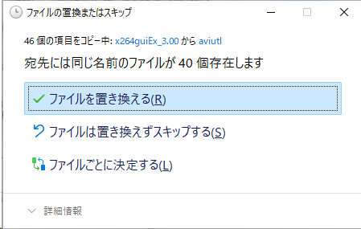
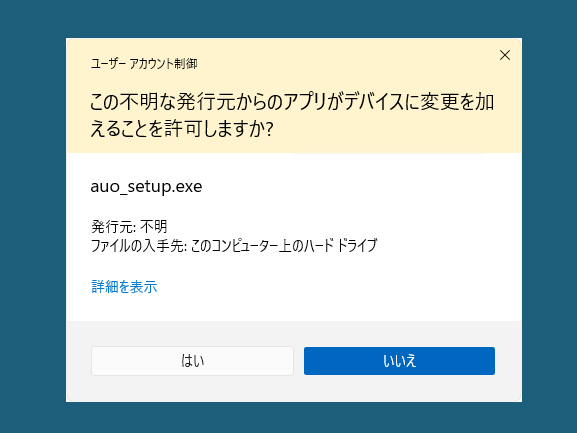
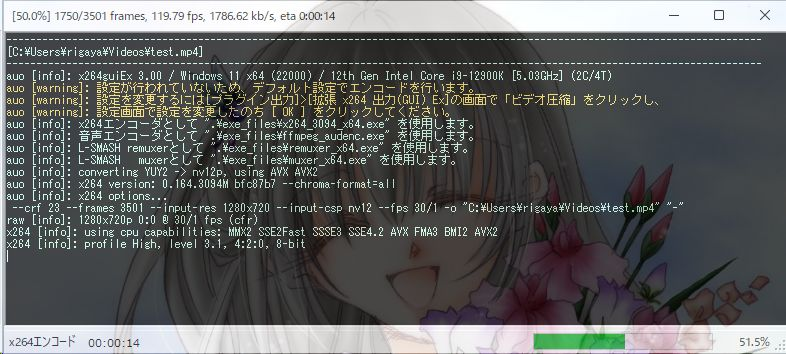

# x264guiEx の Aviutl への導入・更新

## ダウンロード

まず、x264guiExを[こちら](https://github.com/rigaya/x264guiEx/releases)からダウンロードします。

## 導入・更新

ダウンロードしたzipファイルをダブルクリックして開きます。中身はこんな感じです。

中身をすべてAviutlフォルダにコピーします。

更新時には、下記のように上書きするか聞いてくることがあります。

その場合には「ファイルを置き換える」を選択して上書きしてください。

----
このあとAviutlをダブルクリックして起動してください。

初回起動時に必要に応じて下の図のようにx264guiExの使用準備をするというメッセージが出ます。環境によっては準備が不要な場合があり、その場合は表示されません。

OKをクリックすると使用準備が開始されます。

----
下の図のように、「この不明な発行元からのアプリがデバイスに変更を加えることを許可しますか?」というメッセージが表示されますので、「はい」をクリックしてください。

----
下の図のようなウィンドウが表示され、x264guiExの使用に必要なモジュールがインストールされます。

エラーなくインストールが完了すると下記のように表示されますので、ウィンドウを閉じてください。

これで使用準備は完了です。

## 確認

x264guiExがAviutlに認識されているか確認します。

Aviutlの [その他] > [出力プラグイン情報]を選択します。

----
x264guiEx 3.xxが表示されていれば成功です。

## エンコード
[ ファイル ] > [ プラグイン出力 ] > [ 拡張 x264 出力 (GUI) Ex ] を選択し、出力ファイル名を入力して、「保存」をクリックしてください。

エンコードが開始されます。

## アンインストール
アンインストール方法は[こちら](./uninstall.md)。
