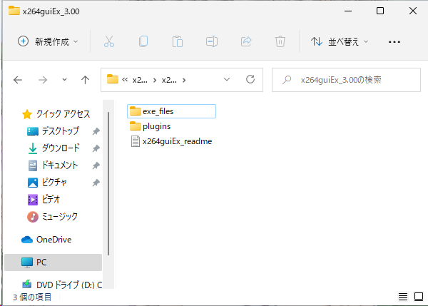
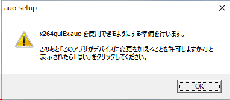
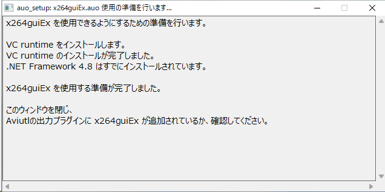
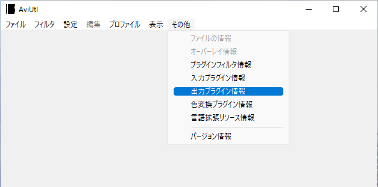
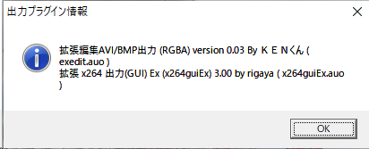

# 拡張 x264 出力(GUI) Ex  
by rigaya

拡張 x264 出力(GUI) Ex (x264guiEx) は、x264を使用してエンコードを行うAviutlの出力プラグインです。

seraphy氏 拡張 x264 出力(GUI) を改造し、x264を分離し、別プロセスとして実行できるようにしたものです。

## ダウンロード & 更新履歴
[こちら＞＞](https://github.com/rigaya/x264guiEx/releases)

## 想定動作環境
Windows 8.1/10/11 (x86/x64)  
Aviutl 1.00 以降

WindowsXPでは動作しません。

## x264guiEx 使用にあたっての注意事項
無保証です。自己責任で使用してください。  
拡張 x264 出力(GUI) Exを使用したことによる、いかなる損害・トラブルについても責任を負いません。  


## x264guiExの使用方法
- [x264guiEx 3.xx 導入・更新＞＞](#x264guiEx-の-Aviutl-への導入・更新)
- [x264guiEx 3.xx 削除＞＞](#x264guiEx-の-Aviutl-からの削除)
- [x264guiExでよく発生するエラーと対処方法＞＞](./x264guiEx_errors.md)
- [x264guiExのプロファイルについてのいろいろ＞＞](http://rigaya34589.blog135.fc2.com/blog-entry-256.html)
- [x264guiEx ログウィンドウについてる機能＞＞](http://rigaya34589.blog135.fc2.com/blog-entry-290.html)
- [MediaInfoによるx264のオプション表示の取り込み方法＞＞](http://rigaya34589.blog135.fc2.com/blog-entry-266.html)
- [x264guiExの上限設定＞＞](http://rigaya34589.blog135.fc2.com/blog-entry-329.html)
- [x264guiExでBluray用出力＞＞](http://rigaya34589.blog135.fc2.com/blog-entry-333.html)
- [x264guiExのその他の設定＞＞](http://rigaya34589.blog135.fc2.com/blog-entry-343.html)

## x264guiEx の Aviutl への導入・更新

下記では動画で導入方法を紹介していますので、こちらも参考としてみてください。(画像をクリック。)  
[](https://www.youtube.com/watch?v=pTfFv_V2Isc)

### ダウンロード

まず、x264guiExを[こちら](https://github.com/rigaya/x264guiEx/releases)からダウンロードします。

### 導入・更新

ダウンロードしたzipファイルをダブルクリックして開きます。中身はこんな感じです。



中身をすべてAviutlフォルダにコピーします。


更新時には、下記のように上書きするか聞いてくることがあります。

その場合には「ファイルを置き換える」を選択して上書きしてください。


  
  
  
このあとAviutlをダブルクリックして起動してください。

初回起動時に必要に応じて下の図のようにx264guiExの使用準備をするというメッセージが出ます。環境によっては準備が不要な場合があり、その場合は表示されません。

OKをクリックすると使用準備が開始されます。


  
  
  
下の図のように、「この不明な発行元からのアプリがデバイスに変更を加えることを許可しますか?」というメッセージが表示されますので、「はい」をクリックしてください。


  
  
  
下の図のようなウィンドウが表示され、x264guiExの使用に必要なモジュールがインストールされます。

エラーなくインストールが完了すると下記のように表示されますので、右上の[x]ボタンでウィンドウを閉じてください。



これで使用準備は完了です。

### 確認

x264guiExがAviutlに認識されているか確認します。

Aviutlの [その他] > [出力プラグイン情報]を選択します。




x264guiEx 3.xxが表示されていれば成功です。




### エンコード
[ ファイル ] > [ プラグイン出力 ] > [ 拡張 x264 出力 (GUI) Ex ] を選択し、出力ファイル名を入力して、「保存」をクリックしてください。


エンコードが開始されます。


エンコードが完了するまで待ちます。お疲れ様でした。

## エラーが起こったら
x264guiExでよく発生するエラーと対処方法を[こちら](./x264guiEx_errors.md)にまとめましたので、エラーメッセージを参考に対処方法をご確認ください。

## 多言語対応

現在、日本語、英語、中国語の切り替えに対応しています。

中国語については、Aviutlの中国語対応をされているNsyw様に翻訳いただきました。メッセージ量の多い中、ご対応いただき、ありがとうございました！

他の言語については、x264guiEx.auoと同じフォルダに下記2ファイルを置くことで、新たな言語を追加できます。

| ファイル名 | 翻訳元 |
|:---        |:---   |
| x264guiEx.<2文字の言語コード>.lng | x264guiEx.ja.lng |
| x264guiEx.<2文字の言語コード>.ini | x264guiEx.ja.ini |

いずれもUTF-8で保存してください。

## 利用するx264について
x264.exeは基本的に同梱のもので問題ありませんが、使用するx264.exeを差し替えることが可能です。ただし、x264 r1673 (2010年 7月頃)以降が必須です。

64bitOSではx264 x64版が使用可能です。そのほうが速いです。(0～15%程度)

## iniファイルによる拡張
x264guiEx.iniを書き換えることにより、音声エンコーダやmuxerのコマンドラインを変更できます。また音声エンコーダを追加することもできます。

デフォルトの設定では不十分だと思った場合は、iniファイルの音声やmuxerのコマンドラインを調整してみてください。


## エンコ前後バッチ処理
出力したファイルに対してなんらかの処理をするためのものです。
指定されたbatファイルから特定の文字列を検索し、置換を行ったバッチファイルを実行します。

```
 -- 共通置換文字列 --
;コマンドライン部分で共通で使用できる置換名
%{vidpath} … 一時動画ファイル名(フルパス)
%{audpath} … 一時音声ファイル名(フルパス)
%{tmpdir}  … 一時フォルダ名(最後の\無し)
%{tmpfile} … 一時ファイル名(フルパス・拡張子除く)
%{tmpname} … 一時ファイル名(ファイル名のみ・拡張子除く)
%{savpath} … 出力ファイル名(フルパス)
%{savfile} … 出力ファイル名(フルパス・拡張子除く)
%{savname} … 出力ファイル名(ファイル名のみ・拡張子除く)
%{savdir}  … 出力フォルダ名(最後の\無し)
%{aviutldir} … Aviutl.exeのフォルダ名(最後の\無し)
%{chpath} … チャプターファイル名(フルパス)   (%{savfile}[chapter_appendix])
%{tcpath} … タイムコードファイル名(フルパス) (%{tmpfile}[tc_appendix])
%{muxout} … muxで作成する一時ファイル名(フルパス)
%{x264path}     … 指定された x264.exe のパス
%{x264_10path}  … 指定された x264.exe(10bit版) のパス
%{audencpath}   … 実行された音声エンコーダのパス
%{mp4muxerpath} … mp4 muxerのパス
%{mkvmuxerpath} … mkv muxerのパス
%{fps_scale}        … フレームレート(分母)
%{fps_rate}         … フレームレート(分子)
%{fps_rate_times_4} … フレームレート(分子)×4
%{sar_x} / %{par_x} … サンプルアスペクト比 (横)
%{sar_y} / %{par_y} … サンプルアスペクト比 (縦)
%{dar_x}            … 画面アスペクト比 (横)
%{dar_y}            … 画面アスペクト比 (縦)
 -- 以下エンコ後バッチファイルでのみ使用できるもの --
%{logpath}      … ログファイルのパス
 -- 以下はmuxを行った場合のみ --
%{chapter}      … チャプターファイルへのパス (チャプターを追加するよう指定した時のみ)
%{chap_apple}   … Apple形式のチャプターファイルへのパス (チャプターを追加するよう指定した時のみ)
```

## x264guiEx の Aviutl からの削除

x264guiEx の Aviutl から削除するには、"plugins" フォルダ内の下記ファイルとフォルダを削除してください。

- [フォルダ] x264guiEx_stg
- [ファイル] x264guiEx.auo
- [ファイル] x264guiEx.conf (存在する場合のみ)
- [ファイル] x264guiEx(.ini)
- [ファイル] auo_setup.auf


## 注意事項
- 自動フィールドシフト使用上の制限  
自動フィールドシフト使用時はx264のvbv-bufsize,vbv-maxrateは正しく反映されません。
これは、エンコード中にタイムコードを取得して、mux時にタイムコードを反映させるためです。

- 2passの制限  
自動フィールドシフト(afs)を有効にした場合、
「自動マルチパス」以外の方法での2-pass(およびn-pass)エンコードは失敗します。
これは afsによるdrop数が2pass目以降
事前にわかっていなければならないためです。
自動フィールドシフトを使わない場合は問題ないです。


## ソースコードについて
- MITライセンスです。

### ソースの構成
VCビルド  
文字コード: UTF-8-BOM  
改行: CRLF  
インデント: 空白x4  
