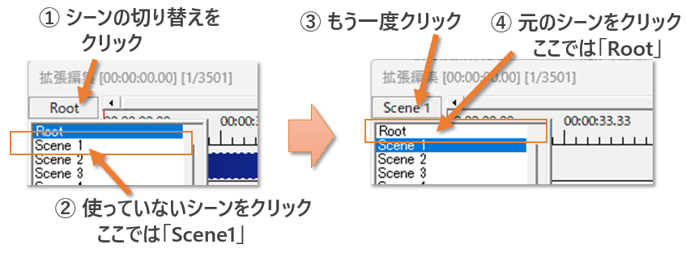

# x264guiEx エラーと対処方法
x264guiEx 2.xx/3.xxのよくあるエラーメッセージと対処方法をまとめました。

エラー発生時には(多くの場合)ログウィンドウにエラーメッセージが表示されます。赤、あるいは黄の字で表示されるエラーメッセージを確認いただき、下記から該当するものを探してみてください。

該当するものがない場合やよくわからない場合は、x264guiExの設定を初期化すると改善する場合があります。"plugins" フォルダ内のx264guiEx.confを削除して再度出力してみてください。

それでも解消しない場合は、[twitter](https://twitter.com/rigaya34589)か[ブログのコメント](https://rigaya34589.blog.fc2.com/blog-category-5.html)等で具体的なエラーの状況をお聞かせください。

- [x264guiEx エラーと対処方法](#x264guiex-エラーと対処方法)
  - [「ファイルの出力に失敗しました。」といきなり出る](#ファイルの出力に失敗しましたといきなり出る)
  - [出力フレーム数が 0 フレームのため、エンコードできません。](#出力フレーム数が-0-フレームのためエンコードできません)
  - [音声の長さが動画の長さと大きく異なるようです。](#音声の長さが動画の長さと大きく異なるようです)
    - [拡張編集を使用している場合](#拡張編集を使用している場合)
    - [拡張編集を使用していない場合](#拡張編集を使用していない場合)
  - [NeroAacEnc.exe の場所が指定されていません。](#neroaacencexe-の場所が指定されていません)
    - [音声エンコーダとしてneroaacencを選択した記憶がない場合、あるいはよくわからない場合](#音声エンコーダとしてneroaacencを選択した記憶がない場合あるいはよくわからない場合)
    - [音声エンコーダとしてneroaacencを選択した場合](#音声エンコーダとしてneroaacencを選択した場合)
  - [入力解像度が 2 で割りきれません。](#入力解像度が-2-で割りきれません)
  - [x264.exe の場所が指定されていません。](#x264exe-の場所が指定されていません)
  - [x264が予期せず途中終了しました。x264に不正なパラメータ（オプション）が渡された可能性があります。](#x264が予期せず途中終了しましたx264に不正なパラメータオプションが渡された可能性があります)
    - [パターン1: x264\[error\]: baseline profile doesn't support lossless](#パターン1-x264error-baseline-profile-doesnt-support-lossless)
    - [パターン2: x264 \[error\]: could not open output file](#パターン2-x264-error-could-not-open-output-file)
      - [パターン2-1: 環境依存文字 (ファイル)](#パターン2-1-環境依存文字-ファイル)
      - [パターン2-2: 環境依存文字 (フォルダ)](#パターン2-2-環境依存文字-フォルダ)
      - [パターン2-3: アクセス権の問題](#パターン2-3-アクセス権の問題)
    - [パターン3: mp4 \[error\]: failed to append a video frame.](#パターン3-mp4-error-failed-to-append-a-video-frame)
  - [映像の出力ファイル ～ を開くことができません。](#映像の出力ファイル--を開くことができません)
    - [パターン1: アクセス権の問題](#パターン1-アクセス権の問題)
    - [パターン2: 環境依存文字 (ファイル)](#パターン2-環境依存文字-ファイル)
  - [出力先フォルダを認識できないため、出力できません。](#出力先フォルダを認識できないため出力できません)
  - [音声エンコーダ ～ は、mp4 形式での出力に対応していません。](#音声エンコーダ--はmp4-形式での出力に対応していません)
  - [出力音声ファイルがみつかりません。qaac での音声のエンコードに失敗しました。](#出力音声ファイルがみつかりませんqaac-での音声のエンコードに失敗しました)
  - [qaac \[error\]: ERROR: CoreAudioToolbox.dll: 指定されたモジュールが見つかりません。](#qaac-error-error-coreaudiotoolboxdll-指定されたモジュールが見つかりません)
  - [mux後ファイルが小さすぎます。](#mux後ファイルが小さすぎます)
  - [mux後ファイルが見つかりませんでした。](#mux後ファイルが見つかりませんでした)
    - [mp4 形式での出力に非対応の音声エンコーダ](#mp4-形式での出力に非対応の音声エンコーダ)
    - [そのほか](#そのほか)

## 「ファイルの出力に失敗しました。」といきなり出る
x264guiEx 2.72以前のバージョンで設定がなされていなかったり、設定が飛んでしまった場合に起こります。一度、[ビデオ圧縮]から設定画面を開いていただき、設定をやり直すことで解決できます。

また、x264guiEx 2.72で前回出力時の設定を自動で読み込むようにして対策済みなので、最新版への更新をお勧めします。

## 出力フレーム数が 0 フレームのため、エンコードできません。
出力するフレームの範囲(選択範囲)が短すぎ、かつ[設定] > [フレームレートの変更] で 1/3などフレームレートを削減する設定になっていると発生することがあります。

選択範囲が本当に出力したい範囲をすべて選択しているか、[フレームレートの変更]の設定が適切であるか再確認してください。

## 音声の長さが動画の長さと大きく異なるようです。

拡張編集を使用している場合、そうでない場合に分かれます。

### 拡張編集を使用している場合

```
auo [warning]: 音声の長さが映像の長さと異なるようです。
auo [warning]: 映像: 0:01:56.700, 音声: 0:00:01.000
auo [error]: 拡張編集の音声トラックとAviutl本体の音声トラックが競合していて、
auo [error]: 拡張編集側で編集した音声が出力されず、意図した音声出力ができない可能性が高いです。
```

Aviutlの拡張編集側の音声と本体側の音声読み込み機能が競合し、本体側に読み込ませた音声が優先されてしまうことにより発生する場合があります。([詳細はこちら](https://rigaya34589.blog.fc2.com/blog-entry-1446.html))

こうした場合には、下の図のように適当に拡張編集でシーン切り替えを一度行って戻した後(例えば Root → Scene1 → Root のように、切り替えて戻す)、再び拡張編集側の音声が有効になりますので、再出力することで改善する場合があります。



ただ、拡張編集側の音声のサンプリングレートとAviutl本体側の音声のサンプリングレートが異なる場合には、これで解決できない場合もあります。

拡張編集使用時には、**Aviutl本体側に音声を読み込まないようにご注意いただければと思います。**

### 拡張編集を使用していない場合

```
auo［warning］: 音声の長さが動画の長さと大きく異なるようです。
                これが意図したものでない場合、音声が正常に出力されていないかもしれません。
                この問題は圧縮音声をソースとしていると発生することがあります。
```

Aviutl本来の音声読み込みで圧縮音声を読み込んでいる場合に発生することがあります。この場合には、音声を非圧縮のwav形式等で読み込むよう、変更してみてください。

## NeroAacEnc.exe の場所が指定されていません。
### 音声エンコーダとしてneroaacencを選択した記憶がない場合、あるいはよくわからない場合  
x264guiEx 2.72以前のバージョンで設定がなされていなかったり、設定が飛んでしまった場合に起こります。一度、[ビデオ圧縮]から設定画面を開いていただき、設定をやり直すことで解決できます。

また、x264guiEx 2.72で前回出力時の設定を自動で読み込むようにして対策済みなので、最新版への更新をお勧めします。

### 音声エンコーダとしてneroaacencを選択した場合  
neroaacencの場所が未指定のことが原因です。設定画面からneroaacencの場所を設定しなおすか、x264guiEx 3.00で自動的に音声エンコーダの場所を探すよう変更したので、最新版への更新をお勧めします。

## 入力解像度が 2 で割りきれません。
縦か横の入力解像度が2で割り切れない(偶数でない)場合に発生します。

x264guiExではエンコードの際、縦横両方の解像度が偶数である必要があります。偶数になっていない場合は、Aviutl本体の「クリッピング&リサイズ」で上下左右どこかの1pixelを切り落とし、偶数になるよう調整してください。

## x264.exe の場所が指定されていません。
x264guiEx 2.73以前のバージョンでx264の場所が設定されていない場合に発生します。x264guiEx 3.00で自動的にx264の場所を探すよう変更したので、最新版への更新をお勧めします。


## x264が予期せず途中終了しました。x264に不正なパラメータ（オプション）が渡された可能性があります。
```
auo[error]: x264が予期せず途中終了しました。x264に不正なパラメータ(オプション)が渡された可能性があります。
```

いくつかのパターンが存在します。

### パターン1: x264[error]: baseline profile doesn't support lossless
こんな表示が出ます。
```
x264[error]: baseline profile doesn't support lossless
```
x264guiEx 2.49以前のバージョンで設定がなされていなかったり、設定が飛んでしまった場合に起こります。一度、[ビデオ圧縮]から設定画面を開いていただき、設定をやり直すことで解決できます。

また、x264guiEx 2.72で前回出力時の設定を自動で読み込むようにして対策済みなので、最新版への更新をお勧めします。

### パターン2: x264 [error]: could not open output file
出力ファイルを開けない系のエラーです。

#### パターン2-1: 環境依存文字 (ファイル)
```
mp4 [error]: cannot open output file `F:\temp\sakura_op?.mp4'.
x264 [error]: could not open output file `F:\temp\sakura_op?.mp4'
auo [error]: x264が予期せず途中終了しました。x264に不正なパラメータ(オプション)が渡された可能性があります。
```
Aviutlは環境依存文字に対応していません。上記文中 "?" になっているところが該当の文字なので、該当文字を含まないファイル名で出力しなおしてください。


#### パターン2-2: 環境依存文字 (フォルダ)
```
mp4 [error]: cannot open output file `F:\temp\てすと?\sakura_op.mp4'.
x264 [error]: could not open output file `F:\temp\てすと?\sakura_op.mp4'
auo [error]: x264が予期せず途中終了しました。x264に不正なパラメータ(オプション)が渡された可能性があります。
```
Aviutlは環境依存文字に対応していません。上記文中 "?" になっているところが該当の文字なので、該当文字を含まないフォルダに出力しなおしてください。

#### パターン2-3: アクセス権の問題
```
mp4 [error]: cannot open output file `C:\sakura_op.mp4'.
x264 [error]: could not open output file `C:\sakura_op.mp4'
auo [error]: x264が予期せず途中終了しました。x264に不正なパラメータ(オプション)が渡された可能性があります。
```

アクセス権がないフォルダ、あるいはWinodwsにより保護されたフォルダを出力先に選択してしまった場合に発生します。

Windowsでは、以下の場所が保護されたフォルダとなっております。
- C: ドライブ直下
- C:\Windows 以下
- C:\ProgramData 以下
- C:\Program Files 以下
- C:\Program Files (x86) 以下

出力先のフォルダを変更して出力してみてください。

### パターン3: mp4 [error]: failed to append a video frame.
出力は始まるのだけど、途中でエラーが発生してしまう場合、またログに下記のように"failed to append a video frame"と表示される場合が該当します。
```
auo [info]: x264 options...
--crf 23 --frames 3501 --input-res 1280x720 --input-csp nv12 --fps 30/1 -o "D:\sakura_op.mp4" "-"
raw [info]: 1280x720p 0:0 @ 30/1 fps (cfr)
x264 [info]: using cpu capabilities: MMX2 SSE2Fast SSSE3 SSE4.2 AVX FMA3 BMI2 AVX2
x264 [info]: profile High, level 3.1, 4:2:0, 8-bit
mp4 [error]: failed to append a video frame.
x264 [info]: frame I:40 Avg QP:18.38 size: 42507
x264 [info]: frame P:739 Avg QP:22.12 size: 14793
x264 [info]: frame B:1350 Avg QP:25.07 size: 3449
x264 [info]: consecutive B-frames: 8.7% 8.4% 35.4% 47.5%
x264 [info]: mb I I16..4: 20.3% 67.1% 12.6%
x264 [info]: mb P I16..4: 6.2% 14.5% 1.2% P16..4: 33.0% 10.5% 5.9% 0.0% 0.0% skip:28.8%
x264 [info]: mb B I16..4: 0.8% 1.3% 0.1% B16..8: 32.5% 2.6% 0.4% direct: 2.1% skip:60.2% L0:41.6% L1:52.0% BI: 6.4%
x264 [info]: 8x8 transform intra:65.9% inter:78.9%
x264 [info]: coded y,uvDC,uvAC intra: 33.0% 46.6% 13.4% inter: 9.4% 14.3% 0.8%
x264 [info]: i16 v,h,dc,p: 41% 31% 9% 18%
x264 [info]: i8 v,h,dc,ddl,ddr,vr,hd,vl,hu: 25% 24% 33% 3% 3% 3% 4% 3% 4%
x264 [info]: i4 v,h,dc,ddl,ddr,vr,hd,vl,hu: 25% 19% 18% 6% 8% 8% 7% 6% 4%
x264 [info]: i8c dc,h,v,p: 56% 25% 16% 3%
x264 [info]: Weighted P-Frames: Y:19.4% UV:18.7%
x264 [info]: ref P L0: 68.6% 13.0% 13.2% 5.1% 0.1%
x264 [info]: ref B L0: 85.1% 12.6% 2.3%
x264 [info]: ref B L1: 96.9% 3.1%
x264 [info]: kb/s:1948.90

aborted at input frame 2194, output frame 2128
encoded 2128 frames, 309.21 fps, 1948.35 kb/s
auo [error]: x264が予期せず途中終了しました。x264に不正なパラメータ(オプション)が渡された可能性があります。
```

ディスクの空き容量不足で発生している可能性があります。出力先のディスク容量を確認し、空き容量を十分確保してから、再度実行してみてください。

x264guiEx 3.02以降は下記のように表示されますが、同様の対処を行ってください。

```
auo [error]: x264が予期せず途中終了しました。
auo [error]: Dドライブの空き容量が残り 0.03 MBしかありません。
auo [error]: Dドライブの空き容量不足で失敗した可能性があります。
auo [error]: Dドライブの空きをつくり、再度実行してみてください。
```

## 映像の出力ファイル ～ を開くことができません。

### パターン1: アクセス権の問題
```
auo [error]: 映像の出力ファイル "C:\sakura_op.mp4" を開くことができません。
auo [error]: アクセスが拒否されました。

auo [error]: このエラーは、アクセス権のないフォルダ、あるいはWindowsにより保護されたフォルダに
auo [error]: 出力しようとすると発生することがあります。
auo [error]: 出力先のフォルダを変更して出力しなおしてください。
auo [error]: なお、下記はWindowsにより保護されたフォルダですので、ここへの出力は避けてください。
auo [error]: 例: C: ドライブ直下
auo [error]:     C:\Windows 以下
auo [error]:     C:\ProgramData 以下
auo [error]:     C:\Program Files (x86) 以下
auo [error]: など
```
アクセス権がないフォルダを出力先に選択してしまった場合に発生します。出力先のフォルダを変更して出力してみてください。

### パターン2: 環境依存文字 (ファイル)

```
auo [error]: 映像の出力ファイル "F:\temp\sakura_op?.mp4" を開くことができません。
auo [error]: ファイル名、ディレクトリ名、またはボリューム ラベルの構文が間違っています。

auo [error]: このエラーは、出力ファイル名に環境依存文字を含む場合に発生することがあります。
auo [error]: 該当文字は、"?"で表示されていますので該当文字を避けてファイル名で出力しなおしてください。
```
Aviutlは環境依存文字に対応していません。上記文中 "?" になっているところが該当の文字なので、該当文字を含まないファイル名で出力しなおしてください。


## 出力先フォルダを認識できないため、出力できません。
```
auo [error]: 出力先フォルダを認識できないため、出力できません。
auo [error]: 出力ファイル名: "F:\temp\てすと?\sakura_op.mp4"
auo [error]: 出力先フォルダ: "F:\temp\てすと?"
auo [error]: このエラーは、上記出力先のフォルダ名に環境依存文字を含む場合に発生することがあります。
auo [error]: 該当文字は、"?"で表示されています。
auo [error]: 環境依存文字を含まないフォルダに出力先に変更して出力しなおしてください。
```
Aviutlは環境依存文字に対応していません。上記文中 "?" になっているところが該当の文字なので、該当文字を含まないフォルダに出力しなおしてください。

## 音声エンコーダ ～ は、mp4 形式での出力に対応していません。
```
auo [error]: 音声エンコーダ WAV出力 は、mp4 形式での出力に対応していません。
auo [error]: AAC (ffmpeg) 等の他の音声エンコーダを選択して出力してください。
```
選択した音声エンコーダがmp4形式での出力に対応していない場合に発生します。
[ビデオ圧縮]から設定画面を開き、音声エンコーダを"AAC (ffmpeg)" 等の他の音声エンコーダに変更して出力しなおしてください。

x264guiEx 3.23以降はこのエラー時に自動で音声エンコーダをデフォルトの"AAC (ffmpeg)"に切り替えるようにしましたので、最新版への更新をお勧めします。

## 出力音声ファイルがみつかりません。qaac での音声のエンコードに失敗しました。
エラーメッセージの前後を再確認いただき、```CoreAudioToolbox.dll:指定されたモジュールが見つかりません。```とのメッセージがあれば、下記を参照してください。

## qaac [error]: ERROR: CoreAudioToolbox.dll: 指定されたモジュールが見つかりません。
音声エンコーダとしてqaacを選択した際に、必要なモジュールの不足により発生するエラーです。
まずは、[ビデオ圧縮]から設定画面を開き、音声エンコーダを"AAC (ffmpeg)" 等の他の音声エンコーダに変更して出力しなおしてください。

qaacを使用したい場合は、QuickTimeのインストールにより必要なモジュールをシステムにインストールすることが可能です。

x264guiEx 3.23以降はこのエラー時に自動で音声エンコーダをデフォルトの"AAC (ffmpeg)"に切り替えるようにしましたので、最新版への更新をお勧めします。


## mux後ファイルが小さすぎます。
こういうメッセージが出るという報告があります。
```
auo [error]: mux後ファイルが小さすぎます。 muxに失敗したものと思われます。
L-SMASH muxer [error]: iTunes MP4 muxing mode
L-SMASH muxer [error]: Track 1: H.264 Advanced Video Coding
L-SMASH muxer [error]: Error: failed to get the last sample delta.
```

古いx264guiExで、音声の長さがゼロとなってしまった場合に発生します。拡張編集使用時は、Aviutlの拡張編集側の音声と本体側の音声読み込み機能が競合している可能性があります。

詳しくは、[音声の長さが動画の長さと大きく異なるようです。/拡張編集を使用している場合](#拡張編集を使用している場合)をご覧ください。

## mux後ファイルが見つかりませんでした。
このようなエラーです。
```
auo [error]: mux後ファイルが見つかりませんでした。
auo [error]: L-SMASH muxer でのmuxに失敗しました。
auo [error]: muxのコマンドラインは…
auo [error]: ".\exe_files\muxer_x64.exe" --file-format m4v -i "F:\temp\sakura_op.1.mp4"?fps=30/1 --file-format m4a -i "F:\temp\sakura_op.1.tmp.wav" --optimize-pd -o "F:\temp\sakura_op.1_muxout.mp4"
L-SMASH muxer [error]: iTunes MP4 muxing mode
L-SMASH muxer [error]: Track 1: H.264 Advanced Video Coding
L-SMASH muxer [error]: Error: the input seems Uncompressed Audio, at present available only for QuickTime file format.
L-SMASH muxer [error]: Error: failed to open input files.
```

### mp4 形式での出力に非対応の音声エンコーダ
エラー文中に、下記のメッセージがある場合、選択した音声エンコーダがmp4形式での出力に対応していないことが原因となります。
```
L-SMASH muxer [error]: Error: the input seems Uncompressed Audio, at present available only for QuickTime file format.
```
```
L-SMASH muxer [error]: [importer: Error]: failed to find the matched importer.
```

[ビデオ圧縮]から設定画面を開き、音声エンコーダを"AAC (ffmpeg)" 等の他の音声エンコーダに変更して出力しなおしてください。

### そのほか
muxエラー原因はいろいろ考えられますので、原因不明のことが多いですが、設定画面右下でmuxer, remuxerを指定している場合、その指定が間違っている可能性があります。

再度指定を確認してみてください。
